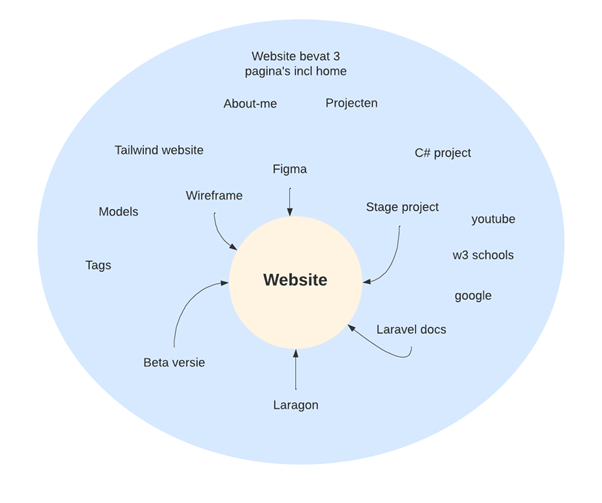

## Briefing

E1 planfase is planning fase van mijn portfolio-website. In deze project ga ik een web-app bouwen. In frontend ga ik Tailwind framework gebruiken. En in backend een Laravel framework en SQL.

Doel van de app is als student op een persoonlijke manier tonen (ofwel; al mijn opdrachten waar ik aan heb gewerkt), zodat u als lezer een beeld heeft van mijn kennis en kunde.

Functionaliteit van de app:

- Styling
- Projecten die ik tijdens mijn studie heb gedaan en/of in mijn vrijetijd
- Voorbeeld of een link per project
- CRUD-systeem om projecten te beheren
- Projecten kunnen in meerdere categorieën vallen (tag-systeem) en hierop kun je ook filteren.

Naast functionaliteit van de app wordt GitHub als versie beheert gebruikt.

## Brainstormen

##  
